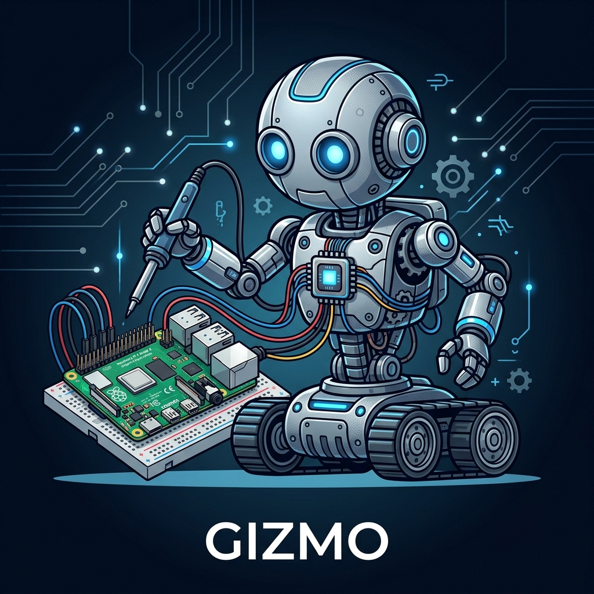
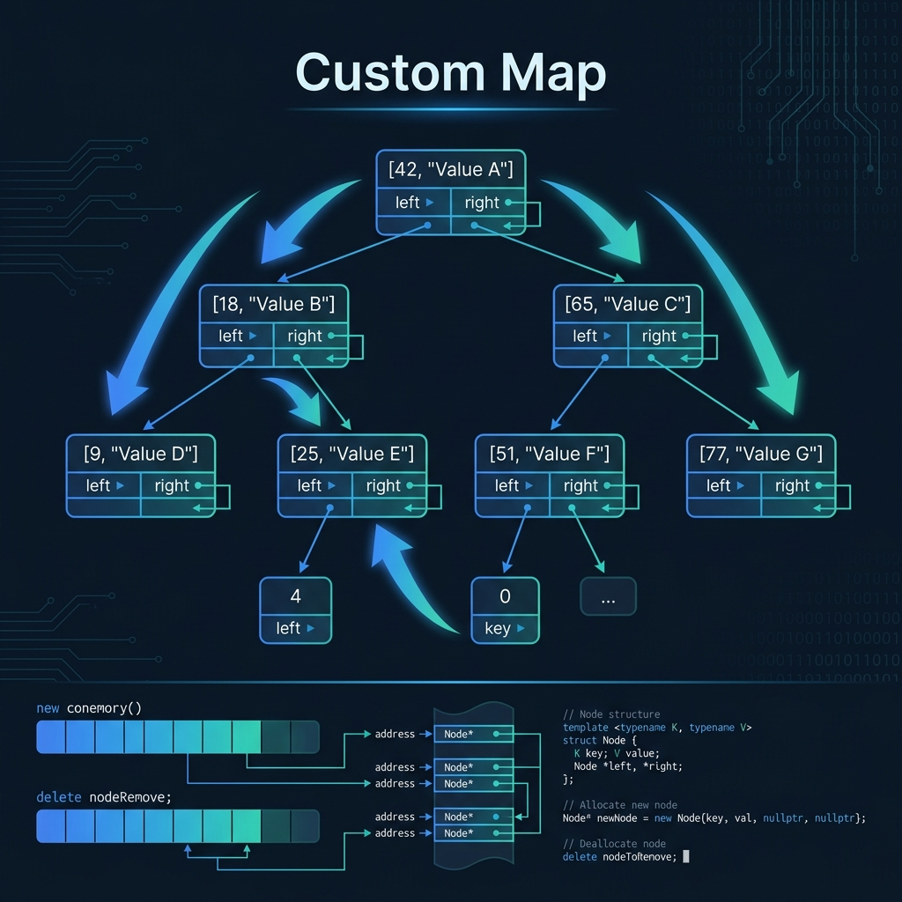
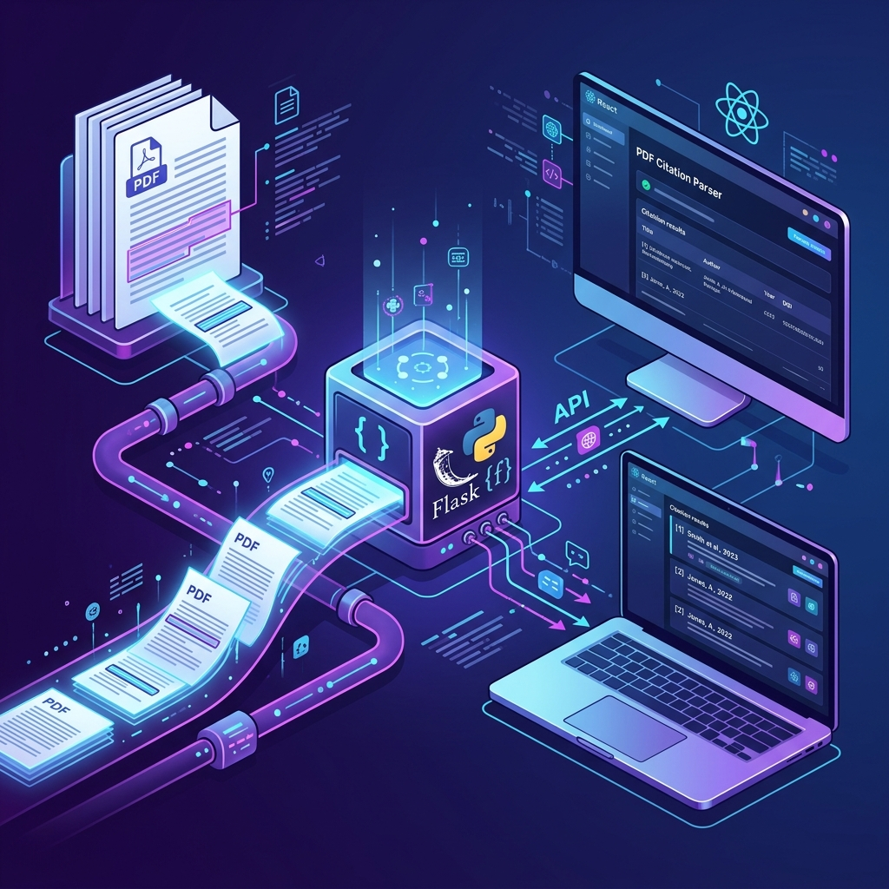

## Portfolio

### Programming Projects

\*For access to my private project repositories, please [email me](mailto:Liriley@csustudent.net?subject=GitHub%20Access) with the subject line, GitHub Access.

---

#### [Gizmo – AI-Powered Meccanoid Robot \| CSCI 498/499](project4)

A capstone senior project that transforms a Meccanoid G15KS toy robot into a fully interactive AI assistant powered by a Raspberry Pi 5, featuring conversational AI (GPT-4o-mini), custom bit-bang servo control, live web search, persistent memory, and expressive gestures.

---

#### [Custom Map \| CSCI 315](project1)

---

#### [Connect Four \| CSCI 325](project2)

---

#### [PDF Citation Parser \| CSCI 495](project3)

---

#### [Endpoint Security Project \| CSCI 352](project5)

---

### Ethics Papers

#### [Software Ethics](pdf/Ethics%20(1).pdf)

- **Class:** CSCI 405 – Principles of Cybersecurity
- **Grade:** B

#### [Automated Ethics](pdf/Automated_Ethics.docx)

- **Class:** CSCI 315 – Data Structure Analysis
- **Grade:** B

#### [Ethical and Legal Analysis in a Corporate Database](pdf/Database_Ethics_Paper.docx)

- **Class:** CSCI 419 – Database Management Systems
- **Grade:** B+

---

### Presentations

#### [Endpoint Security – Hands-On Lab Presentation](pdf/Endpoint%20Security.pdf){:target="_blank"}

- **Class:** CSCI 352 – Cyber Defense
- **Grade:** In Progress

#### [PDF Citation Parser – Video Walkthrough](pdf/PDF%20Presentation.mp4){:target="_blank"}

- **Class:** CSCI 495
- **Grade:**

---

Page template forked from [CSU-CS](https://github.com/csu-cs/csci-portfolio)
