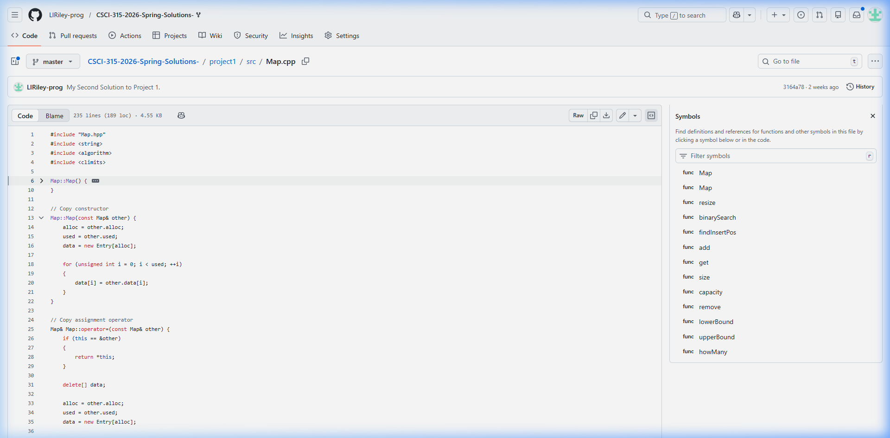
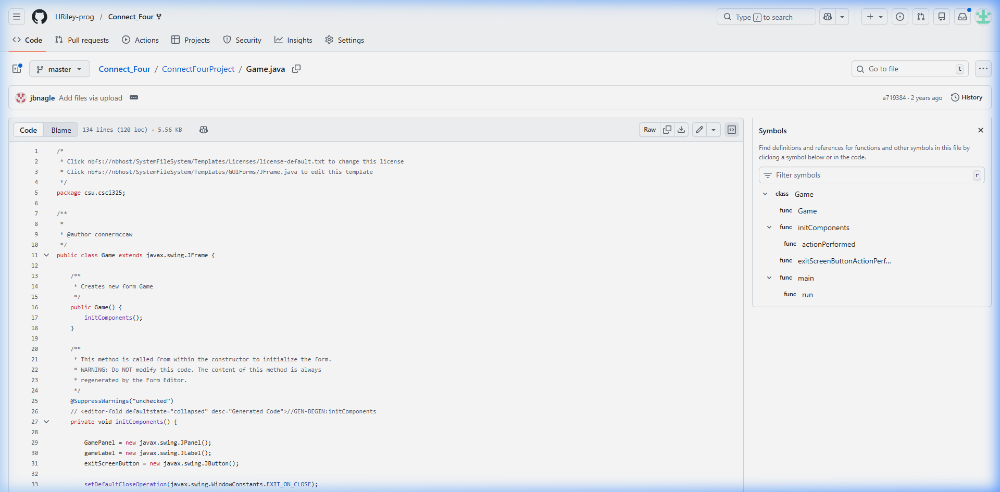
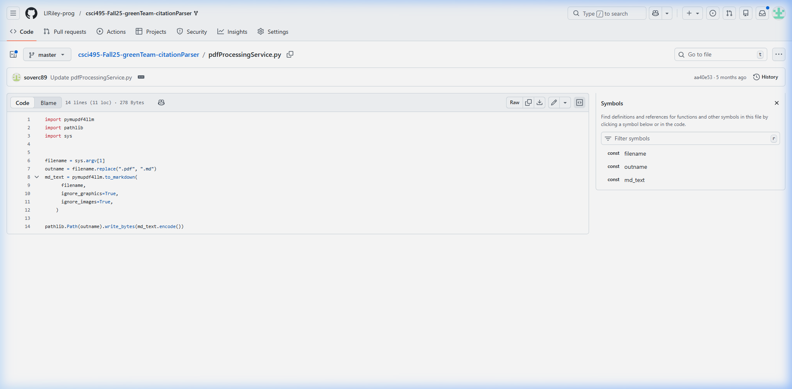

## Portfolio

### Programming Projects

\*For access to my private project repositories, please [email me](mailto:Liriley@csustudent.net?subject=GitHub%20Access) with the subject line, GitHub Access.

---

#### [Custom Map \| CSCI 315](project1)

---

#### [Connect Four \| CSCI 325](project2)

---

#### [PDF Citation Parser \| CSCI 495](project3)

---

#### [AI Robot – Senior Project \| CSCI 499](project4)

---

### Senior Project

#### [Gizmo – Meccanoid AI Assistant \| CSCI 498 & 499](senior_project)

A Raspberry Pi 5–powered AI robot built on a reprogrammed Meccanoid G15KS body. Gizmo uses voice recognition, GPT-4o conversational AI, and servo-driven gestures to interact naturally with users.

- **Repositories:** [Project Documentation](https://github.com/LIRiley-prog/CSU-Senior-Project) · [Source Code](https://github.com/LIRiley-prog/ai_robot)
- **Tech Stack:** Python, OpenAI API, Vosk, PCA9685, Raspberry Pi 5
- **Status:** In Progress

---

### Ethics Papers

#### [Software Ethics](pdf/Ethics%20(1).pdf)

- **Class:** CSCI 405 – Principles of Cybersecurity
- **Grade:** B

#### Paper 2 Title

- **Class:** 
- **Grade:**

#### Paper 3 Title

- **Class:** 
- **Grade:**

---

### Presentations

#### Presentation 1 Title

- **Class:**
- **Grade:**

#### Presentation 2 Title

- **Class:**
- **Grade:**

---

Page template forked from [CSU-CS](https://github.com/csu-cs/csci-portfolio)
