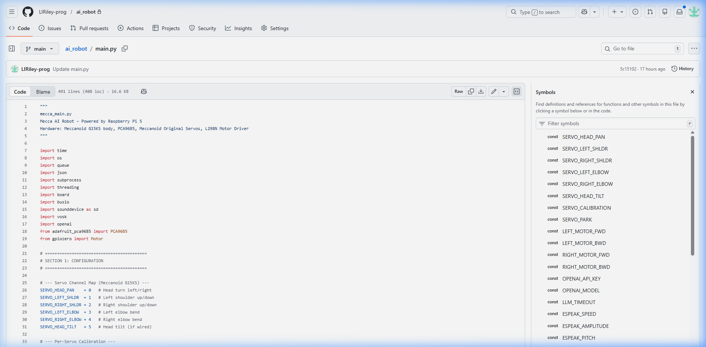

## Portfolio

### Programming Projects

\*For access to my private project repositories, please [email me](mailto:Liriley@csustudent.net?subject=GitHub%20Access) with the subject line, GitHub Access.

---

#### [Hangman \| CSCI 301](project1)

---

#### [Connect Four \| CSCI 315](project2)

---

#### [PDF Citation Parser \| CSCI 325](project3)

---

#### [DIY Router \| CSCI 332](project4)

---

### Ethics Papers

#### [Software Ethics](pdf/ethics1.pdf)

- **Class:** CSCI 315 – Data Structure Analysis
- **Grade:** 92

#### Paper 2 Title

- **Class:** CSCI 419 – Database Management
- **Grade:** B

#### Paper 3 Title

- **Class:** CSCI 235 – Procedural Programming
- **Grade:** C

---

### Presentations

#### Presentation 1 Title

- **Class:**
- **Grade:**

#### Presentation 2 Title

- **Class:**
- **Grade:**

---

Page template forked from [CSU-CS](https://github.com/csu-cs/csci-portfolio)
