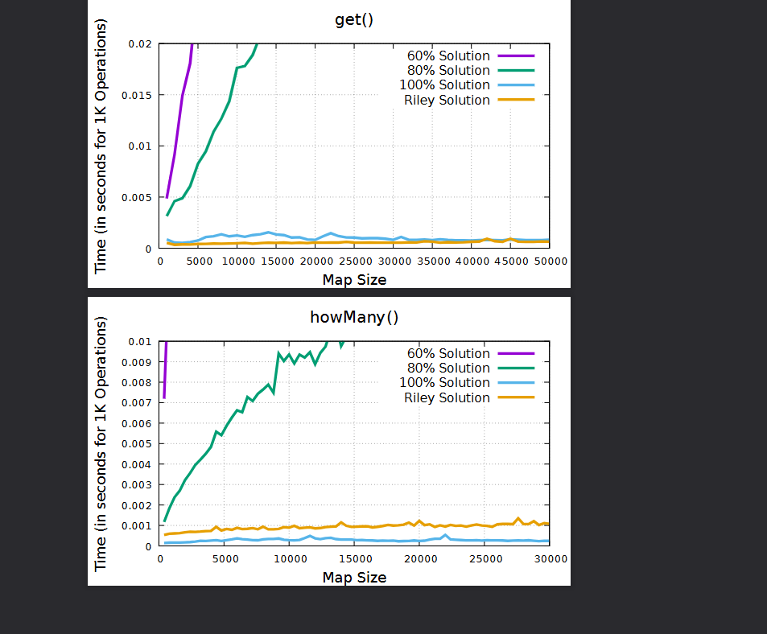

[Back to Portfolio](./)

Custom Map
==========

-   **Class:** CSCI 315 – Data Structure Analysis
-   **Grade:** A
-   **Language(s):** C++
-   **Source Code Repository:** [CSCI-315-2026-Spring-Solutions-](https://github.com/LIRiley-prog/CSCI-315-2026-Spring-Solutions-)  
    (Please [email me](mailto:Liriley@csustudent.net?subject=GitHub%20Access) to request access.)

## Project Description

The Custom Map project was built as part of CSCI 315 – Data Structure Analysis. The goal was to implement a Map data structure from scratch in C++ — similar to how `std::map` works in the C++ standard library, but built entirely by hand without using any built-in containers.

The Map stores key-value pairs and supports operations like inserting new entries, retrieving values by key, removing entries, and searching for keys using binary search. Internally, the data is kept in a sorted array, which makes lookup fast and predictable.

Building the Map also required implementing proper memory management — including a copy constructor and a copy assignment operator — to make sure the data structure behaves safely when copied or assigned to another variable.

## How to Compile and Run the Program

```bash
g++ -o map_test main.cpp Map.cpp
./map_test
```

## System Output & Performance

The program runs as a command-line application. Test cases are run automatically on startup and print their results to the terminal. Output includes:

- **Inserted entries** — confirming key-value pairs were added successfully
- **Lookup results** — displaying values retrieved by key
- **Remove confirmations** — showing entries before and after deletion
- **Edge case results** — handling duplicate keys and out-of-range lookups


<br>*Fig. 1 — Terminal/Plot output demonstrating the performance scaling characteristics of my Custom Map against base implementations.*

## Code Snippets

### Map.hpp — Class Definition


#ifndef MAP_HPP
#define MAP_HPP

#include &lt;string_view&gt;
#include &lt;climits&gt;
#include &lt;string&gt;

class Map {
public:
    Map();
    bool add(const std::string_view key, unsigned int val);
    unsigned int get(const std::string_view key) const;
    unsigned int size() const;
    unsigned int capacity() const;
    bool remove(const std::string_view key);
    unsigned int howMany(const std::string_view prefix) const;
    Map(const Map& other);
    Map& operator=(const Map& other);
    ~Map();
private:
    struct Entry {
        std::string key;
        unsigned int value;
    };
    Entry* data;
    unsigned int used;
    unsigned int alloc;
    int findInsertPos(const std::string_view key) const;
    int binarySearch(const std::string_view key) const;
    int lowerBound(const std::string_view prefix) const;
    int upperBound(const std::string_view prefix) const;
    void resize();
};
#endif


### Map.cpp — Binary Search


int Map::binarySearch(const std::string_view key) const {
    int low = 0;
    int high = static_cast<int>(used) - 1;

    while (low <= high) {
        int mid = low + (high - low) / 2;
        if (data[mid].key == key)
            return mid;
        else if (data[mid].key < key)
            low = mid + 1;
        else
            high = mid - 1;
    }
    return -1;
}


### Map.cpp — Insert (Sorted)


bool Map::add(const std::string_view key, unsigned int val) {
    int idx = binarySearch(key);
    if (idx != -1)
        return false;

    if (used >= alloc)
        resize();

    int insertPos = findInsertPos(key);

    for (int i = static_cast<int>(used); i > insertPos; --i) {
        data[i] = data[i - 1];
    }

    data[insertPos].key = key;
    data[insertPos].value = val;
    used++;
    return true;
}


### Map.cpp — Copy Constructor & Assignment Operator


Map::Map(const Map& other) {
    alloc = other.alloc;
    used = other.used;
    data = new Entry[alloc];
    for (unsigned int i = 0; i < used; ++i) {
        data[i] = other.data[i];
    }
}

Map& Map::operator=(const Map& other) {
    if (this == &other)
        return *this;
    delete[] data;
    alloc = other.alloc;
    used = other.used;
    data = new Entry[alloc];
    for (unsigned int i = 0; i < used; ++i) {
        data[i] = other.data[i];
    }
    return *this;
}


## Additional Considerations

This project reinforced core concepts in data structures including sorted storage, binary search, and manual memory management with `new` and `delete`. Implementing copy semantics (copy constructor and assignment operator) was a key challenge, requiring careful handling of dynamic memory to avoid double-frees and memory leaks.

[Back to Portfolio](./)
