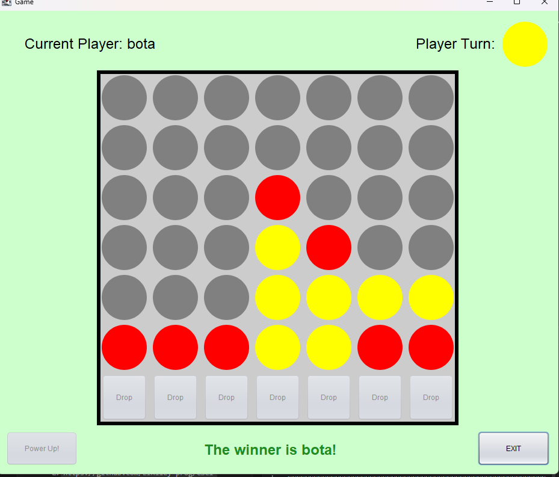

[Back to Portfolio](./)

Connect Four
============

-   **Class:** CSCI 325 – Object-Oriented Programming
-   **Grade:** B
-   **Language(s):** Java (Swing GUI)
-   **Source Code Repository:** [Connect_Four](https://github.com/LIRiley-prog/Connect_Four)  
    (Please [email me](mailto:Liriley@csustudent.net?subject=GitHub%20Access) to request access.)

## Project Description

Connect Four is a fully playable two-player strategy game built in Java using the Swing GUI framework. The project recreates the classic token-dropping board game where two players take turns dropping colored pieces into a 6-row, 7-column vertical grid. The first player to align four of their pieces horizontally, vertically, or diagonally wins the game.

The application features a graphical menu system, player name and color selection with input validation, a live game board, and an end screen with replay functionality. A powerup system was also designed into the architecture, allowing for extended gameplay features such as piece swapping and random moves.

The project is organized under the `csu.csci325` package and structured across multiple Java classes to separate concerns: menu logic, game state, powerup behavior, and end-game handling.

## How to Compile and Run the Program

Compile and run using any Java IDE (such as IntelliJ IDEA or Eclipse), or from the command line:


javac *.java
java ConnectFour


## UI Design

The game uses a Java Swing graphical user interface featuring distinct screens for menu selection, gameplay, and match results. The system automatically detects win conditions (four tokens arranged vertically, horizontally, or diagonally) and prevents moves in full columns.


<br>*Fig. 1 — The game detecting a win condition for 'bota' using yellow pieces.*

The game opens with a **main menu window** containing two buttons: **Start** and **Rules**. Clicking Start opens a setup screen where players input their names and select their piece colors via dropdowns. Validations enforce unique names and different piece colors.

Once setup is complete, the **game window** loads. It features a responsive 7x6 grid populated with interactive buttons corresponding to each column. Player turns alternate automatically, with visual indicators showing current turn state. Upon reaching a win or draw state, an **End Screen** displays the final outcome and provides navigation to replay or return to the menu.

**Menu validation:** The `MenuLogic` class ensures players cannot select the same color, preventing confusion during play.

## Code Snippets

### ConnectFour.java — Start Screen & Entry Point

```java
package csu.csci325;

public class ConnectFour extends javax.swing.JFrame {

    public ConnectFour() {
        initComponents();
    }

    private void startButtonActionPerformed(java.awt.event.ActionEvent evt) {
        this.setVisible(false);
        new Menu().setVisible(true);
    }

    private void rulesButtonActionPerformed(java.awt.event.ActionEvent evt) {
        this.setVisible(false);
        new rulesScreen().setVisible(true);
    }

    public static void main(String args[]) {
        java.awt.EventQueue.invokeLater(new Runnable() {
            public void run() {
                new ConnectFour().setVisible(true);
            }
        });
    }
}
```

### MenuLogic.java — Input Validation

```java
package csu.csci325;

import javax.swing.JComboBox;
import javax.swing.JLabel;
import javax.swing.JTextField;

public class MenuLogic {

    public static GameInformation gameInfo;

    public boolean correctName(JLabel errorLabel,
            JTextField p1NameInput, JTextField p2NameInput) {
        String p1Name = p1NameInput.getText().strip();
        String p2Name = p2NameInput.getText().strip();

        if (p1Name.length() == 0 || p1Name.length() > 20) {
            errorLabel.setText("Player 1: Please enter a valid name "
                    + "between 1 and 20 characters.");
            return false;
        } else if (p2Name.length() == 0 || p2Name.length() > 20) {
            errorLabel.setText("Player 2: Please enter a valid name "
                    + "between 1 and 20 characters.");
            return false;
        } else if (p1NameInput.getText().equals(p2NameInput.getText())) {
            errorLabel.setText("Please enter unique player names.");
            return false;
        }
        return true;
    }

    public boolean differentColors(JLabel errorLabel,
            JComboBox p1, JComboBox p2) {
        String p1Color = (String) p1.getSelectedItem();
        String p2Color = (String) p2.getSelectedItem();
        if (p1Color.equals(p2Color)) {
            errorLabel.setText("Each player must choose a unique color.");
            return false;
        }
        return true;
    }

    public void setGameInformation(JTextField p1NameInput,
            JTextField p2NameInput, JComboBox p1ColorSelector,
            JComboBox p2ColorSelector, JComboBox powerupSelector) {
        gameInfo = new GameInformation(
            p1NameInput.getText(), p2NameInput.getText(),
            (String) p1ColorSelector.getSelectedItem(),
            (String) p2ColorSelector.getSelectedItem(),
            (String) powerupSelector.getSelectedItem());
    }

    public static GameInformation getGameInformation() {
        return gameInfo;
    }
}
```

## Additional Considerations

This project demonstrates object-oriented design principles in Java, including class decomposition, event-driven programming with Swing listeners, and input validation. The `Powerup` class was architected to support future feature expansion, showcasing forward-thinking software design.

[Back to Portfolio](./)
