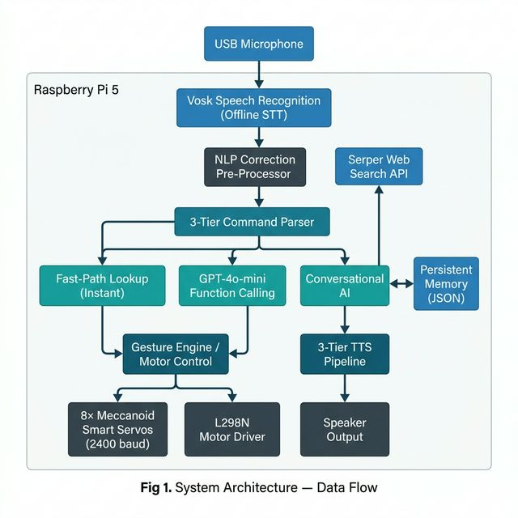
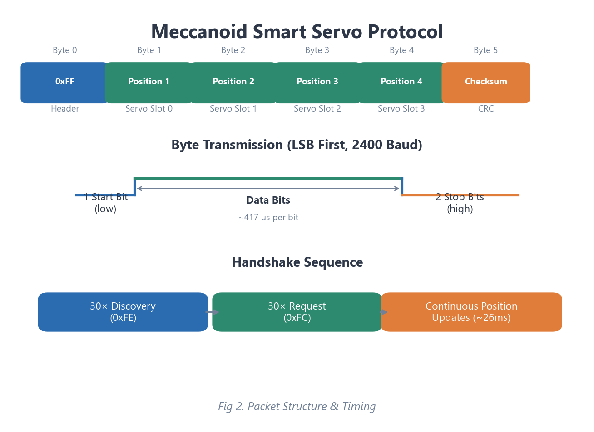
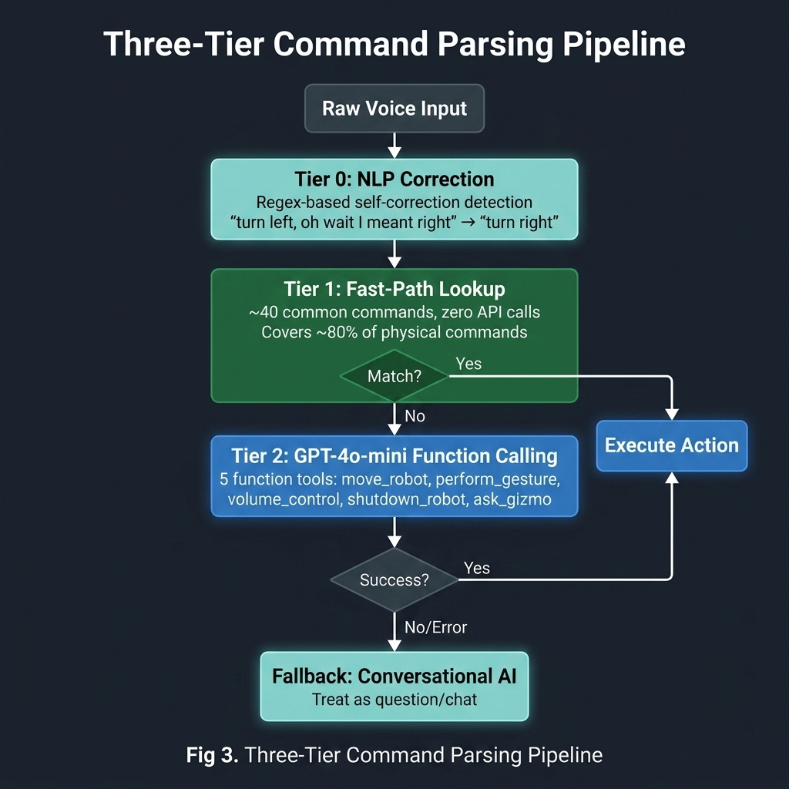
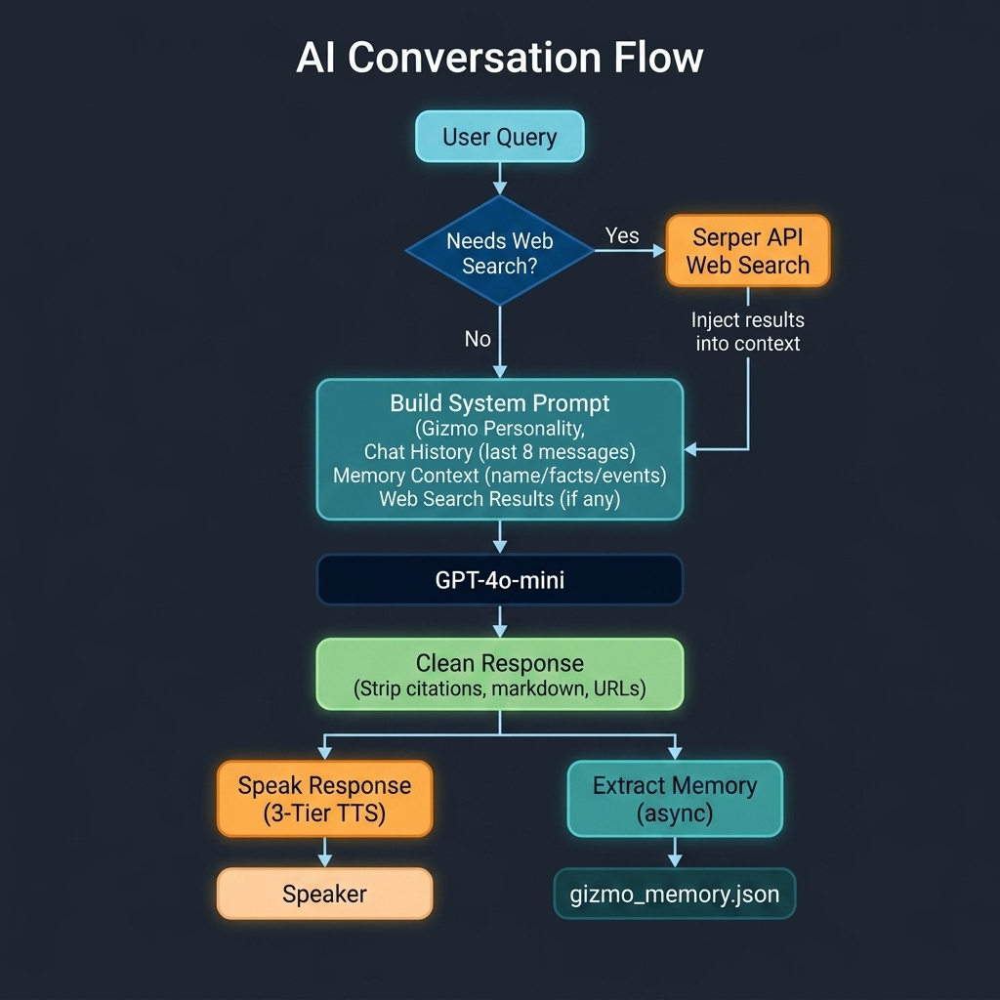
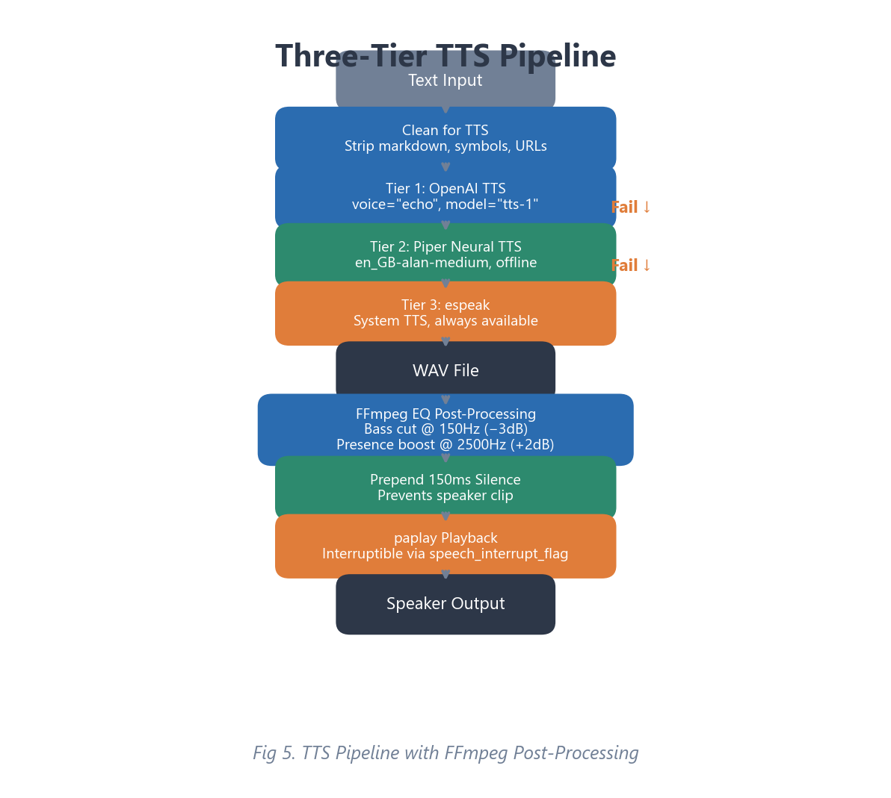

[Back to Portfolio](./)

Gizmo – AI-Powered Meccanoid Robot Assistant
==============================================

-   **Class:** CSCI 498/499 – Senior Project Design & Implementation/Defense
-   **Grade:** In Progress
-   **Language(s):** Python
-   **Source Code Repository:** [ai_robot](https://github.com/LIRiley-prog/ai_robot)  
    (Please [email me](mailto:Liriley@csustudent.net?subject=GitHub%20Access) to request access.)
-   **Project Documentation:** [CSU-Senior-Project](https://github.com/LIRiley-prog/CSU-Senior-Project)

---

## 1. Statement of Purpose

### Problem Statement

Commercial toy robots like the Meccanoid G15KS ship with pre-programmed behaviors and limited interactivity — they cannot hold real conversations, answer questions intelligently, or adapt to their environment. Meanwhile, building a custom robot from scratch requires significant mechanical engineering expertise and financial investment that is impractical for most individuals and teams.

### Purpose

The purpose of this project is to bridge that gap by transforming an off-the-shelf Meccanoid G15KS toy robot into a fully interactive, conversational AI assistant — named **Gizmo** — powered by a Raspberry Pi 5. Gizmo is designed to:

- Understand and respond to natural spoken language using conversational AI
- Execute physical commands (movement, gestures) through voice interaction alone
- Search the web for real-time information such as weather, news, and current events
- Remember personal facts about its owner across sessions through persistent memory
- Express personality through gestures, idle animations, and a custom voice character

The goal is to demonstrate that commodity hardware, open-source tools, and modern AI APIs can be combined into a cohesive, functional robotic system that feels genuinely interactive and alive.

---

## 2. Research & Background

The project draws from several areas of research and technology:

**Conversational AI and Large Language Models.** OpenAI's GPT-4o-mini model serves as Gizmo's "brain," providing natural language understanding, contextual conversation, and function-calling capabilities. Research into prompt engineering was essential to give Gizmo a consistent personality — bright, friendly, and playful — while preventing common AI pitfalls like saying "As an AI" or providing overly verbose responses.

**Speech Recognition.** Vosk, an open-source offline speech recognition toolkit based on the Kaldi framework, was selected for always-on listening capability. Unlike cloud-based alternatives, Vosk processes audio entirely on-device, ensuring Gizmo can listen even without an internet connection. Research into sample rate handling and microphone selection was necessary to support various USB audio devices.

**Text-to-Speech Synthesis.** A three-tier TTS architecture was developed after researching multiple synthesis engines. OpenAI's TTS API provides the highest quality output, Piper (a neural TTS engine) serves as an offline fallback, and espeak provides a last-resort option. FFmpeg audio post-processing research led to a custom equalizer chain for consistent voice character.

**Embedded Servo Control Protocols.** The Meccanoid G15KS smart servos use a proprietary 2400-baud serial protocol that is poorly documented publicly. Research into the protocol's bit-level timing, packet structure (header, 4 data bytes, checksum), and handshake sequence was critical. The original PCA9685 I2C servo driver approach was abandoned after discovering that the Meccanoid servos require this custom serial protocol, not standard PWM signals.

**Real-Time Systems and Threading.** Python's Global Interpreter Lock (GIL) presents challenges for real-time servo control. Research into Linux kernel timing facilities led to the use of `ctypes` to call `clock_nanosleep` directly, which releases the GIL during timing-critical bit-bang operations. This prevents audio processing threads from corrupting servo signal timing.

**Natural Language Processing for Corrections.** Research into spoken language patterns revealed that users frequently self-correct mid-sentence (e.g., "turn left — oh wait, I meant right"). A regex-based pre-processing pipeline was developed to detect and resolve these corrections before command parsing.

---

## 3. Project Language(s), Software, and Hardware

### Programming Language

- **Python 3** — Selected for its extensive library ecosystem, rapid prototyping capability, and strong support for Raspberry Pi GPIO access.

### Software Dependencies

| Library / Tool | Version | Role |
|---|---|---|
| OpenAI Python SDK | Latest | GPT-4o-mini conversational AI, function calling, TTS, and memory extraction |
| Vosk | 0.3.x | Offline speech-to-text recognition (Kaldi-based) |
| Piper TTS | Latest | Offline neural text-to-speech synthesis (fallback) |
| espeak | System | Lightweight TTS engine (last-resort fallback) |
| FFmpeg | System | Audio post-processing — EQ filter for voice character |
| gpiozero | Latest | GPIO pin control for servo bit-banging and motor driver |
| sounddevice | Latest | Microphone audio capture and device enumeration |
| NumPy | Latest | Audio resampling and signal processing |
| python-dotenv | Latest | Environment variable management for API keys |
| Requests | Latest | HTTP client for Serper web search API |
| PulseAudio (paplay/pactl) | System | Audio playback and volume control |
| systemd | System | Service management for auto-start on boot |

### Hardware Components

| Component | Model / Specification | Purpose |
|---|---|---|
| Main Controller | **Raspberry Pi 5** | AI processing, GPIO control, audio I/O |
| Robot Body | **Meccanoid G15KS** | Physical frame with articulated head, arms, and legs |
| Servo Motors (×8) | **Meccanoid G15KS Smart Servos** | Head pan, head tilt, left/right shoulder (×2 each), left/right elbow — controlled via custom 2400-baud serial protocol on individual GPIO pins |
| Motor Driver | **L298N Dual H-Bridge** | Controls two DC drive motors for wheel-based movement |
| Microphone | **USB Microphone** | Voice input for speech recognition |
| Speaker | **USB/Bluetooth Speaker** | Audio output for text-to-speech responses |
| Power Supply | **5V regulated supply** | Powers servos and Raspberry Pi |

---

## 4. Project Requirements

### Functional Requirements

1. **Voice Wake/Sleep** — The robot shall wake from sleep mode when it hears a designated wake phrase (e.g., "Hey Gizmo") and return to sleep on a sleep phrase (e.g., "Goodnight Gizmo").
2. **Conversational AI** — The robot shall hold natural, multi-turn conversations using OpenAI's GPT-4o-mini, maintaining context across exchanges.
3. **Voice Command Execution** — The robot shall interpret and execute spoken movement commands ("move forward," "turn left") and gesture commands ("wave," "raise arms," "look right").
4. **Physical Gesture Library** — The robot shall perform at least 15 distinct physical gestures including wave, nod, shake head, shrug, celebrate, raise/lower arms, and head movements.
5. **Web Search** — The robot shall search the web for real-time information (weather, news, scores) when the user's query requires current data.
6. **Persistent Memory** — The robot shall remember the user's name, personal facts, and notable events across power cycles.
7. **Text-to-Speech** — The robot shall speak responses audibly with a consistent, natural-sounding voice.
8. **Idle Behavior** — The robot shall perform subtle autonomous animations when idle to appear lifelike.
9. **Volume Control** — The robot shall adjust speaker volume via voice commands.
10. **Shutdown** — The robot shall safely shut down via voice command, parking all servos before powering off.

### Non-Functional Requirements

1. **Response Latency** — The robot shall respond to simple commands within 2 seconds and to AI queries within 5 seconds.
2. **Reliability** — The robot shall run continuously as a systemd service with automatic restart on failure.
3. **Graceful Degradation** — The robot shall continue operating if individual subsystems fail (e.g., TTS falls back through three engines; skips gestures for unwired servos).
4. **Hardware Safety** — The robot shall perform a boot-time hardware safety check and report any wiring issues before proceeding.

---

## 5. Project Implementation Description & Explanation

### 5.1 System Overview

Gizmo's software architecture is organized into 12 modular sections within a single main application file (`main.py`, ~2,000 lines) plus a dedicated servo driver module (`meccanoid_smart_servo.py`, ~477 lines). The system operates through multiple concurrent threads coordinated by thread-safe primitives (`threading.Event`, `threading.Lock`, `queue.Queue`).

The overall data flow is: the USB microphone continuously streams audio into a callback function, which feeds raw PCM data (resampled to 16 kHz if necessary) into a Vosk speech recognizer. When the recognizer produces a finalized transcript with sufficient words and a pause is detected, the text enters the three-tier command parser. The parser first applies NLP corrections, then checks a fast-path lookup table, and finally falls back to GPT-4o-mini function calling. The resulting action — movement, gesture, AI conversation, or system command — is executed, and speech output is generated through the three-tier TTS pipeline.



### 5.2 Custom Servo Protocol

The most technically complex component is the Meccanoid smart servo driver (`meccanoid_smart_servo.py`). Unlike standard hobby servos that accept PWM signals, Meccanoid servos use a proprietary 2400-baud serial protocol transmitted via bit-banging on GPIO pins.

Each servo chain requires a continuous stream of 6-byte packets (1 header byte `0xFF`, 4 data bytes for servo positions, and 1 checksum byte) sent at ~26 ms intervals. The protocol begins with a handshake sequence: 30 discovery packets (`0xFE` in all data slots) followed by 30 request packets (`0xFC` in all data slots). After handshake, the servo requires constant position updates to hold its position — if packets stop, the servo goes limp.

Each byte is transmitted LSB-first with 1 start bit, 8 data bits, and 2 stop bits at 2400 baud (~417 µs per bit). Achieving this timing precision in Python required using `ctypes` to call the Linux kernel's `clock_nanosleep` system call directly, which releases the GIL during the sleep and prevents other Python threads from corrupting the bit timing.

All eight servos run on individual GPIO pins, each with its own `MeccanoidChain` instance running a background thread. This design ensures each servo chain maintains its own packet timing independently.



### 5.3 Three-Tier Command Parsing

When Gizmo hears a finalized transcript, it passes through three processing tiers designed for maximum speed and natural language understanding:

**Tier 0: NLP Correction Pre-Processing.** A regex-based pipeline detects mid-sentence self-corrections. For example, "turn your head left oh wait I meant right" is corrected to "turn your head right" before further processing. The system handles six distinct correction patterns including "actually," "oh wait," "I meant," and bare direction swaps.

**Tier 1: Fast-Path Lookup.** A table of ~40 common commands maps directly to robot functions with zero API calls. Commands like "wave," "go forward," "look left," and "volume up" are resolved instantly. This covers approximately 80% of all physical commands and eliminates unnecessary API latency.

**Tier 2: GPT-4o-mini Function Calling.** For commands not in the fast-path table (e.g., "can you do that head thing where you look over there" or "walk 3 feet"), GPT-4o-mini is called with a set of five function tools (`move_robot`, `perform_gesture`, `volume_control`, `shutdown_robot`, `ask_gizmo`). The model selects the appropriate function and extracts parameters from the natural language input.

If Tier 2 also fails (network error, timeout), the system falls back to treating the input as a conversational query.



### 5.4 Conversational AI and Web Search

Gizmo's AI personality is injected via a system prompt that establishes its character: bright, friendly, and slightly playful. The prompt instructs the model to use contractions naturally, keep responses to 1–3 sentences, avoid markdown formatting, and never reference being an AI.

Chat history is maintained across exchanges (last 8 messages, popped in pairs to maintain user/assistant coherence). Memory context — the user's name, known facts, and past events — is injected into every system prompt.

When the user's query contains trigger keywords (e.g., "weather," "news," "price," "score"), the system automatically fetches live search results via the Serper API and injects them into the AI context. This allows GPT-4o-mini to provide accurate, up-to-date answers without requiring a specialized model.



### 5.5 Text-to-Speech Pipeline

Speech output follows a three-tier fallback chain:

1. **OpenAI TTS** — Highest quality; uses the "echo" voice for a light, energetic character.
2. **Piper** — Offline neural TTS using the `en_GB-alan-medium` model; good quality without internet.
3. **espeak** — System-level TTS engine; robotic but always available.

All three engines output to WAV files, which are then post-processed through an FFmpeg equalizer chain (slight bass cut at 150 Hz, mild presence boost at 2500 Hz) for consistent voice character across engines. A 150 ms silence is prepended to prevent the first word from being clipped by speaker wake-up latency. Playback uses `paplay` with a global process reference that enables mid-playback interruption when the user speaks.



### 5.6 Persistent Memory System

Gizmo remembers its owner across sessions through a JSON file (`gizmo_memory.json`) that stores:

- **User name** — How to address the owner
- **Personal facts** — Up to 25 facts extracted from conversations (e.g., "user likes cats")
- **Notable events** — Timestamped events (e.g., "Gizmo booted for the first time")
- **Last seen date** — Used for personalized greetings

After each conversation exchange, GPT-4o-mini is called asynchronously in a background thread to extract any memorable personal facts from the dialogue. This extraction runs in parallel with normal operation, adding no perceived latency.

### 5.7 Idle Animation System

When Gizmo hasn't been spoken to for more than 45 seconds, a background thread begins playing subtle autonomous animations at randomized intervals (minimum 15 seconds between animations). The animation pool includes eight behaviors:

- Glancing left or right
- Curious head tilt (tilt + slight pan offset)
- Slow room scan (left-to-right sweep)
- Subtle head tilt
- Small arm shift
- Full-body stretch (both arms raise slightly)

If Gizmo remains idle for over 2 minutes, it gently returns all servos to their parked positions. Idle animations are suppressed while Gizmo is speaking.

### 5.8 Gesture System

Gizmo includes 18 pre-programmed gesture sequences that are triggered by voice commands or automatically during conversation. Each gesture uses smooth servo interpolation (`smooth_move`) for natural-looking motion. Gestures that benefit from simultaneous speech (e.g., wave + "Hi there!") run speech and movement in parallel threads, so the arm moves while Gizmo is talking rather than after a multi-second delay.

The gesture system also performs servo safety checks: before executing a gesture, it verifies that all required servos are in the `CONNECTED_SERVOS` set. If a required servo is not wired, the gesture is skipped and Gizmo says "That servo isn't wired up yet."

### 5.9 Startup and Boot Sequence

On boot, Gizmo runs a structured startup sequence:

1. **Hardware Safety Check** — Sends a test command to each servo chain and reports pass/fail status with wiring troubleshooting hints.
2. **Park All Servos** — Moves all servos to calibrated neutral positions and waits 4 seconds for physical movement to complete.
3. **Stop Motors** — Ensures drive motors are not running.
4. **API Pre-Warm** — Makes a silent API call in a background thread to establish the connection, preventing the first real command from being slow due to cold connection startup.
5. **Cache Thinking Phrases** — Pre-renders all thinking phrases to WAV files in a background thread using the same voice as normal speech, enabling instant playback during AI processing.
6. **Greeting** — Gizmo announces it is online (or warns about hardware failures).

Gizmo runs as a systemd user service (`gizmo.service`) for automatic startup on boot with automatic restart on failure.

### Source Code

The full source code is available at: [ai_robot](https://github.com/LIRiley-prog/ai_robot)  
(Please [email me](mailto:Liriley@csustudent.net?subject=GitHub%20Access) to request access.)

---

## 6. Test Plan

Testing was conducted across four categories to validate all major subsystems:

### 6.1 Automated Command Test Suite (`test_gizmo.py`)

An automated test harness (`test_gizmo.py`) mocks all hardware (GPIO, PCA9685, motors) and OpenAI API calls, allowing the full command parsing pipeline to be tested on any machine without physical hardware. The test suite covers:

| Test Category | # Tests | What is Tested |
|---|---|---|
| Wake/Sleep | 2 | Wake phrase activation, sleep phrase deactivation |
| Movement (fast-path) | 5 | Forward, backward, left, right, stop — all via instant lookup |
| Gestures (fast-path) | 13 | Wave, arms up/down, look left/right/forward/up/down, nod, shrug, celebrate, park |
| Volume Control | 5 | Volume up, down, mute, louder, quieter |
| Natural Language (AI) | 6 | Jokes, time queries, natural gesture requests, distance commands |
| Sleep Gate | 1 | Commands ignored while sleeping |
| Memory System | 1 | Memory file loads without errors |
| **Total** | **33** | |

### 6.2 Hardware Diagnostic Tests

| Test Script | Purpose |
|---|---|
| `diag_quick.py` | Quick servo chain diagnostic — tests handshake, thread health, GPIO status, and sends gentle ±15° movements |
| `test_wiring.py` | Interactive wiring test — sweeps each servo 45° → 135° → 90° with LED color changes to visually confirm connections |
| `test_motors.py` | Drive motor test — runs each motor forward/backward to verify L298N wiring |
| `test_arms.py` | Arm-specific movement test for calibrating shoulder and elbow ranges |

### 6.3 Integration Tests

| Test | Method |
|---|---|
| Voice recognition accuracy | Manually spoke 50+ commands at varying distances and noise levels; verified correct transcription in terminal logs |
| End-to-end conversation | Held multi-turn conversations to verify chat history, personality consistency, and memory extraction |
| Web search integration | Asked weather, news, and price questions to verify Serper API results were correctly injected into AI context |
| Speech interruption | Spoke while Gizmo was talking to verify mid-speech interruption and audio queue flushing |
| Concurrent operation | Verified servos maintained position while TTS played and Vosk processed audio simultaneously |

### 6.4 Stress and Reliability Tests

| Test | Method |
|---|---|
| Long-duration runtime | Ran Gizmo continuously for 4+ hours to verify no memory leaks, thread deadlocks, or servo drift |
| Rapid command sequences | Issued commands in rapid succession to verify queue handling and thread coordination |
| Network failure recovery | Disconnected Wi-Fi during AI queries to verify graceful fallback to offline TTS and appropriate error messages |
| Power cycle recovery | Verified systemd service restarts Gizmo cleanly after unexpected shutdown |

---

## 7. Test Results

### 7.1 Automated Test Suite Results

All 33 automated tests pass consistently:

```
═════════════════════════════════════════════════════════════════
  🤖  GIZMO AUTOMATED TEST SUITE
═════════════════════════════════════════════════════════════════

[ 1. WAKE / SLEEP ]
  ✅ PASS — Wake phrase activates Gizmo
  ✅ PASS — Sleep phrase sends Gizmo to sleep

[ 2. MOVEMENT (instant fast-path) ]
  ✅ PASS — Go forward
  ✅ PASS — Go backward
  ✅ PASS — Turn left
  ✅ PASS — Turn right
  ✅ PASS — Stop

[ 3. GESTURES (instant fast-path) ]
  ✅ PASS — Wave
  ✅ PASS — Arms up
  ...

[ 7. MEMORY SYSTEM ]
  ✅ PASS — Memory system loaded without errors

  RESULTS: 33/33 passed  🎉 All clear!
═════════════════════════════════════════════════════════════════
```

### 7.2 Hardware Diagnostic Results

All eight servo chains pass the diagnostic check:

```
  ✓  Head Pan             OK (commands sent)
  ✓  Head Tilt            OK (commands sent)
  ✓  Left Shoulder 1      OK (commands sent)
  ✓  Left Shoulder 2      OK (commands sent)
  ✓  Left Elbow           OK (commands sent)
  ✓  Right Shoulder 1     OK (commands sent)
  ✓  Right Shoulder 2     OK (commands sent)
  ✓  Right Elbow          OK (commands sent)
```

### 7.3 Integration Test Results

| Test | Result | Notes |
|---|---|---|
| Voice recognition (close range) | ✅ Pass | Accurate at 1–3 feet in quiet environment |
| Voice recognition (noisy) | ⚠️ Partial | Accuracy degrades with background noise; MIN_WORDS filter prevents false triggers |
| Multi-turn conversation | ✅ Pass | Chat history maintains context across 4+ exchanges |
| Web search (weather) | ✅ Pass | Correctly retrieves and speaks current conditions |
| Speech interruption | ✅ Pass | User speech kills playback within 50 ms |
| Concurrent servo + TTS | ✅ Pass | `clock_nanosleep` prevents GIL timing corruption |
| Long-duration (4 hrs) | ✅ Pass | No memory leaks or thread deadlocks observed |
| Network failure | ✅ Pass | Falls back to Piper TTS; AI responds with appropriate error messages |

---

## 8. Challenges Overcome

**Challenge 1: Servo Protocol Reverse Engineering.**
The Meccanoid G15KS smart servos do not use standard PWM. The original design used a PCA9685 I2C servo driver, which produced no movement. After extensive research and experimentation, the proprietary 2400-baud serial protocol was reverse-engineered, and a custom bit-bang driver was built from scratch. This required understanding the packet structure, handshake sequence, and continuous-refresh requirement.

**Challenge 2: GIL-Induced Timing Corruption.**
Python's Global Interpreter Lock caused the Vosk audio processing thread to steal CPU time during servo bit-bang timing, corrupting the serial signal and causing erratic servo behavior. The solution was to replace Python's `time.sleep()` with `ctypes` calls to the Linux kernel's `clock_nanosleep`, which releases the GIL during the sleep and provides nanosecond-precision timing.

**Challenge 3: Startup Servo Jerk.**
On boot, all servos would violently snap to 90° (center) before moving to their calibrated park positions. This was solved by pre-loading the park angles into each `MeccanoidChain` instance's position buffer *before* the handshake sequence, so the very first position packets sent to the servos already contain the correct resting positions.

**Challenge 4: TTS Latency.**
The initial design spoke a "thinking" phrase synchronously (2–3 seconds for TTS) and then made the AI API call (1–3 seconds), resulting in 3–6 seconds of silence. This was solved by: (1) pre-caching all thinking phrases at startup, (2) playing cached audio (instant) in parallel with the AI API call, and (3) starting the AI query in a background thread while the thinking phrase plays.

**Challenge 5: Self-Hearing.**
Gizmo would sometimes hear its own voice through the microphone and attempt to process it as a user command, creating feedback loops. This was solved by flushing the audio queue after each speech output and adding a brief cooldown period before re-processing microphone input.

**Challenge 6: Thread Coordination.**
With 8+ concurrent threads (8 servo chains, audio callback, idle animation, main voice loop, background AI/memory tasks), deadlocks and race conditions were a constant risk. Thread-safe primitives (`threading.Event` for flags, `threading.Lock` for shared state, `queue.Queue` for audio data) and daemon thread configuration ensured clean coordination and shutdown.

---

## 9. Future Enhancements

1. **Computer Vision** — Add a camera module for face recognition, object detection, and visual awareness using OpenCV or a vision AI model.
2. **Emotion Detection** — Use sentiment analysis on user speech to adjust Gizmo's gestures and tone dynamically (e.g., comforting gestures when the user sounds upset).
3. **LED Eye Expressions** — *(Implemented)* The Meccanoid's built-in LED eyes are wired on GPIO 21 and display seven colors (off, red, green, yellow, blue, cyan, white) based on Gizmo's current state: blue while idle/listening, green while speaking, yellow while thinking, red on error, and a white flash on wake/boot.
4. **Autonomous Navigation** — Add ultrasonic or LiDAR distance sensors for obstacle avoidance and autonomous room exploration.
5. **Multi-User Recognition** — Use voice fingerprinting to identify different users and load personalized memory profiles.
6. **Streaming TTS** — Implement streaming text-to-speech that begins speaking as tokens arrive from the AI, rather than waiting for the complete response.
7. **Custom Wake Word Model** — Replace Vosk-based wake word detection with a dedicated wake word engine (e.g., OpenWakeWord) for lower latency and higher accuracy.
8. **Mobile App Control** — Build a companion mobile app for remote control, configuration, and monitoring.

---

## 10. Defense Presentation Slides

[Defense Presentation Slides (PDF)](pdf/SeniorProjectDefense.pdf)

*(To be uploaded after the defense presentation.)*

---

[Back to Portfolio](./)
